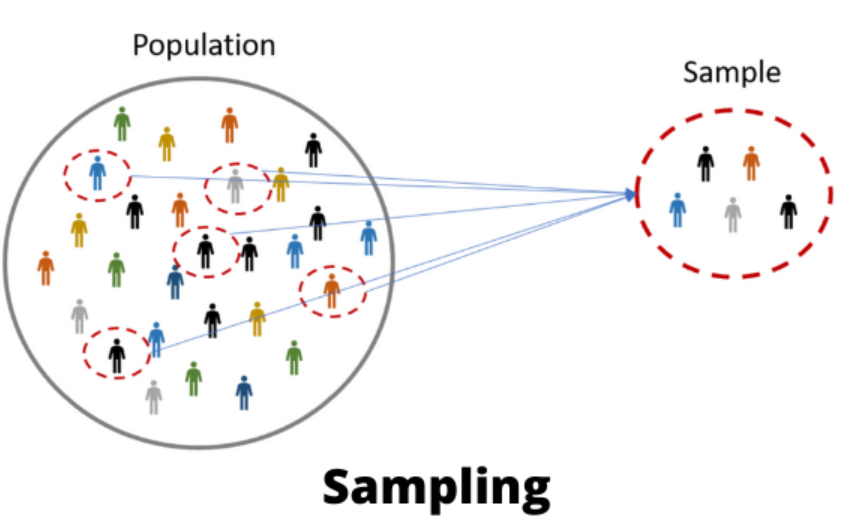
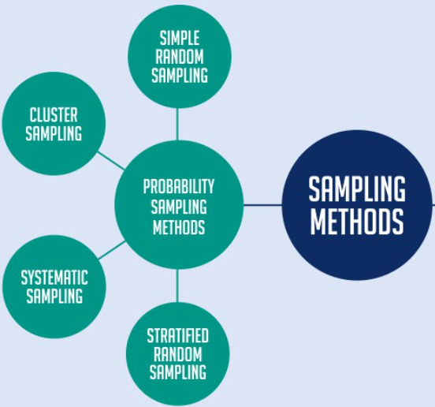
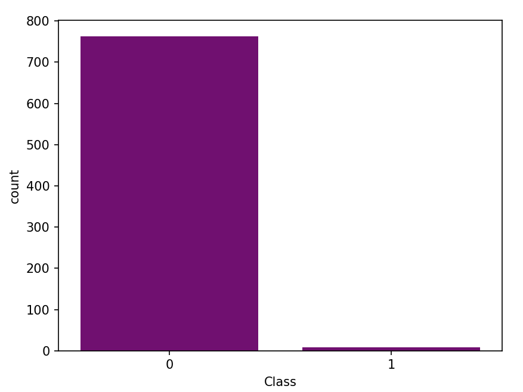

## SAMPLING 

Sampling is the **process of selecting a subset of elements** from a larger population to represent and analyze, often used in research or statistics to draw conclusions about the entire group based on the sampled data.

## Types of Sampling

## Dataset
The dataset used in this project is available in Creditcard_data.csv. It contains the following columns:

**Time**: Number of seconds elapsed between this transaction and the first transaction in the dataset.  
**V1-V28**: Principal components obtained with PCA, anonymized features.  
**Amount**: Transaction amount.  
**Class**: Target variable indicating whether the transaction is fraudulent (1) or not (0).  

## PLOT 

## Sampling Techniques Used

**RandomUnderSampler**  :A method that randomly removes instances from the majority class to balance class distribution in imbalanced datasets. 

**SVMSMOTE**  :It combines Support Vector Machines (SVM) and Synthetic Minority Over-sampling Technique (SMOTE) to generate synthetic examples for the minority class, aiming to improve the performance of models on imbalanced classification tasks. 

**SMOTE (Synthetic Minority Over-sampling Technique)**  :A method that generates synthetic samples in the minority class by interpolating between existing instances to address class imbalance. 

**BorderlineSMOTE**  :A variation of SMOTE that focuses on generating synthetic samples near the borderline between classes to address imbalanced datasets.

**ADASYN (Adaptive Synthetic Sampling)**  :A technique similar to SMOTE but adjusts the sampling density based on the level of difficulty of learning areas to generate more informative synthetic samples.

## Classifier Used

**LogisticRegression** : A linear model used for classification that predicts the probability of an instance belonging to a particular class.

**DecisionTreeClassifier**  : A non-parametric model that makes decisions based on a tree-like structure, learning simple decision rules inferred from the data features. 

**RandomForestClassifier**  : An ensemble learning method that constructs multiple decision trees during training and outputs the class that is the mode of the classes of the individual trees.

**Gaussian Naive Bayes**  : Gaussian Naive Bayes is commonly applied to problems where the assumption of normally distributed features is reasonable, and it's known for its simplicity and effectiveness in various classification scenarios.

**GradientBoostingClassifier**  : A boosting ensemble method that builds a strong classifier by combining multiple weak classifiers in a stage-wise manner, minimizing the loss function's gradient.  

we are generating 5 Datasets using above mentioned sampling techniques and then we calculate accuracy for predicted data for each model. Result is stored in **final.csv**.